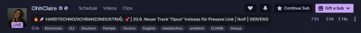

# Twitch Title Shortener

A lightweight userscript that automatically shortens long Twitch stream titles and displays the full title on hover.


## 📋 Description

Ever been frustrated by impossibly long Twitch stream titles that break layouts or make the interface cluttered? This userscript solves that problem by:

- ✂️ Automatically shortens stream titles to a reasonable length
- 👁️ Showing the full title when you hover over it
- 🎨 Maintaining Twitch's styling
- ⚡ Zero performance impact - pure CSS solution
- 🔧 Works on all Twitch pages

<div align="center">
  
</div>

## 🚀 Installation

### Prerequisites
You'll need a userscript manager installed in your browser:
- [Tampermonkey](https://www.tampermonkey.net/) (Chrome, Firefox, Safari, Edge)
- [Greasemonkey](https://www.greasespot.net/) (Firefox)
- [Violentmonkey](https://violentmonkey.github.io/) (Chrome, Firefox, Edge)

### Install the Script

#### Method 1: Direct Installation (Recommended)
1. **[Click here to install](https://github.com/ODRise/STwitchT/raw/refs/heads/main/twitch-title-truncator.user.js)**
2. Your userscript manager will automatically detect and prompt you to install
3. Click "Install" in the popup
4. Navigate to [Twitch.tv](https://www.twitch.tv) - the script will activate automatically!

#### Method 2: Manual Installation
1. Download or copy the [`twitch-title-truncator.user.js`](./twitch-title-truncator.user.js) file
2. Open your userscript manager dashboard
3. Click "Create a new script" or import the file
4. Save (Ctrl+S or Cmd+S)
5. Navigate to [Twitch.tv](https://www.twitch.tv)

## 📝 Usage

Once installed, the script works automatically:
- Long stream titles will be truncated with "..." at the end
- Hover over any truncated title to see the full text
- The full title appears in a styled tooltip that matches Twitch's theme

## ⚙️ Customization

You can customize the script by modifying these values:

```css
/* Change the maximum width before truncation */
max-width: 400px !important;  /* Default: 400px */

/* Adjust hover tooltip styling */
background: #18181b !important;  /* Twitch dark background */
padding: 5px !important;
border-radius: 4px !important;
```

## 🛠️ Technical Details

- **No JavaScript execution** - Uses pure CSS for maximum performance
- **Respects Twitch's design** - Maintains original styling and theme
- **Universal compatibility** - Works on all Twitch pages and layouts
- **Dynamic content ready** - Handles dynamically loaded stream titles

## 🤝 Contributing

Contributions are welcome! Feel free to:
- Report bugs
- Suggest new features
- Submit pull requests

### Development
1. Fork the repository
2. Create your feature branch (`git checkout -b feature/AmazingFeature`)
3. Commit your changes (`git commit -m 'Add some AmazingFeature'`)
4. Push to the branch (`git push origin feature/AmazingFeature`)
5. Open a Pull Request

## 🐛 Known Issues

- Titles containing user mentions (@username) may have special styling that needs additional handling
- Very long single words without spaces might overflow

## 📜 License

This project is licensed under the MIT License - see the [LICENSE](LICENSE) file for details.

## 👏 Acknowledgments

- Thanks to the Twitch community for inspiration
- Built for streamers with creative (and lengthy) title game

## 📊 Changelog

### Version 1.0.1 (2025)
- Initial release
- Basic truncation functionality
- Hover tooltip implementation
- Twitch dark theme support

---

**Enjoy cleaner Twitch browsing! 🎮**

If you find this useful, consider giving it a ⭐ on GitHub!
